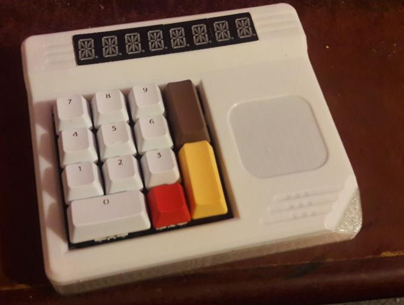
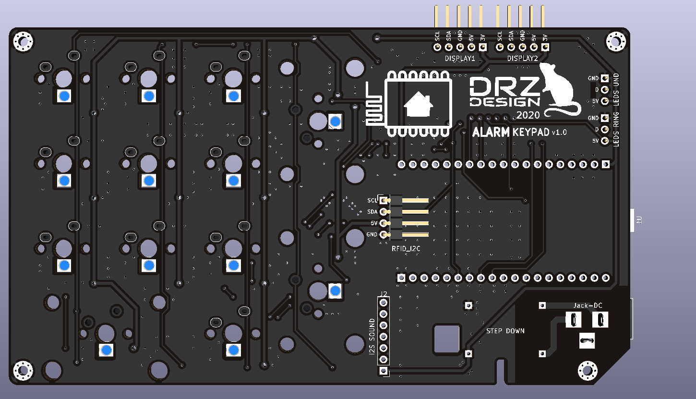
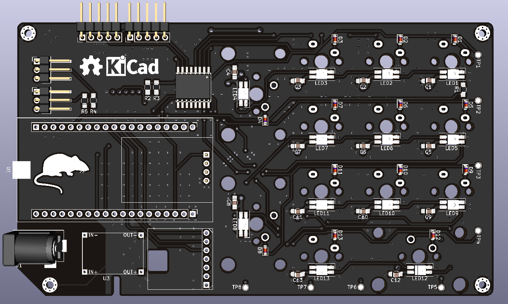

# Esphome Alarm Keypad

! README IN PROGRESS !

The Alarm Keypad is an interface to the Home Assistant Alarm Control Panel

//TODO: insert link here of ha alarm integration

Goal is to have a nice alarm control panel with lights, displays, rfid tag reader and a backup keypad to arm/disarm the Home Assistant alarm.

## Features

- 13 key keyboard with mechanical switches . behind a pcf8574 i2c i/o expander
- per key adressable rgb backlight (13)
- pn532 rfid reader
- adressable led strip for case backlight
- adressable led ring for rfid feedback
- two 4 character alphanum displays with ht16k33 backpacks
- RTTTL sound output

## Hardware:

kicad/ contain the custom made pcb with all i/o from and to the esp, integrating the keypad with per key smd rgb backlight.

## Software:

//TODO: link to my-esphome github repo

### boot

    loading sequence on leds and screen

### connected

    show alarm state (armed/disarmed and so on)

### disconnected

    show "ERROR"

### rfid scan

    animate rfid led ring
    HA tag scanned service, changing alarm state if correct tag?

### key press

    flash key backlight in one color
    enter typing state

### typing

    show "code ?" + asterisk each pressed key until 4
    when 4 (allowed) keys pressed enter code check state
    start timer to enter typing timeout if no key pressed in X seconds

### typing timeout

    do something animated with case and keypad leds
    return back to alarm state mode

### code check

    display "check..." until we got a state change in HA alarm, or entering a 5sec timeout
    do something animated with case and keypad leds
### code check timeout

    HA alarm state didn't changed so the code is wrong or there is a problem
    display "FAIL" for 3 sec and go back to alarm state mode
    do something animated with case and keypad leds
